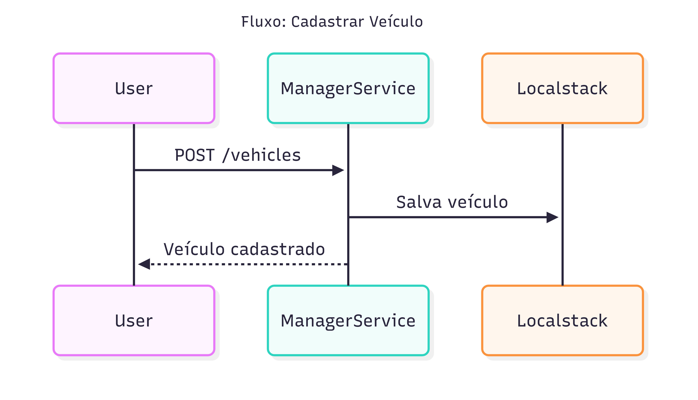
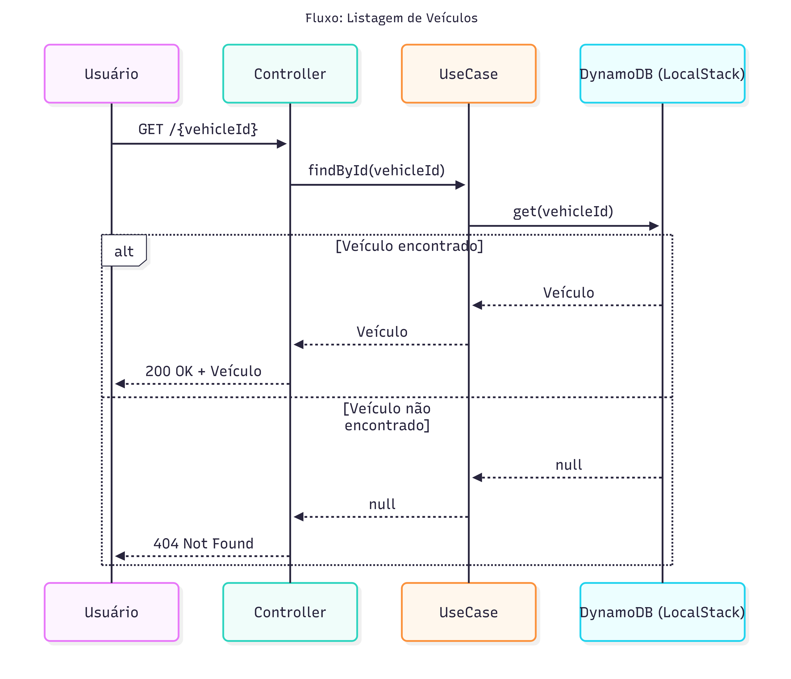
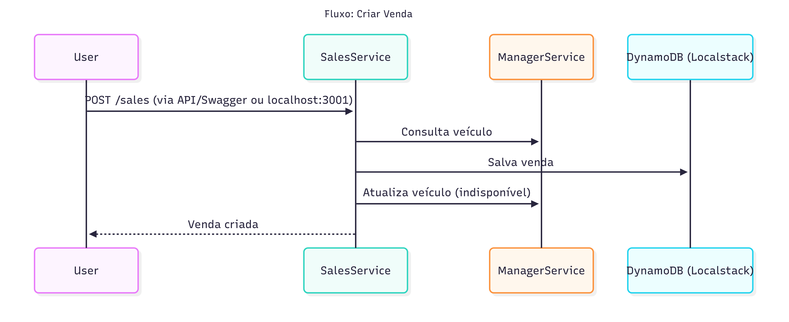
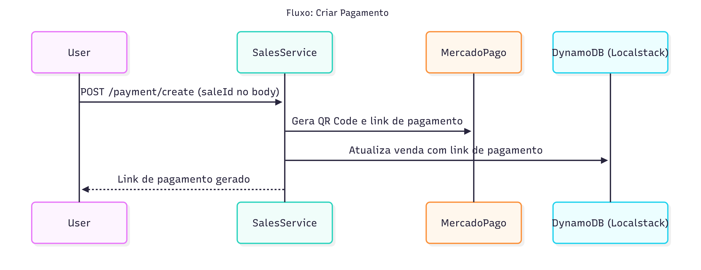
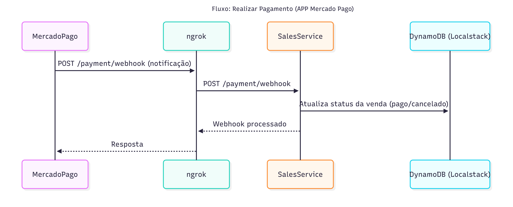
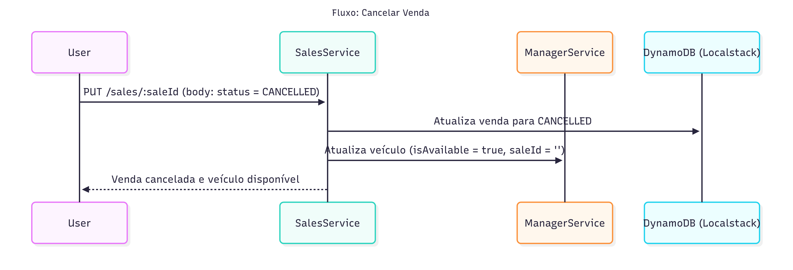

[](https://sonarcloud.io/summary/new_code?id=leandradz_vehicle-orchestration)


# vehicle-orchestration

Este diretório orquestra os microsserviços do projeto de vendas e gestão de veículos, incluindo integração com Mercado Pago e exposição de webhooks via ngrok.

## Pré-requisitos
- Docker
- Docker Compose
- Bash (para rodar o script de automação)

## Como rodar os serviços

1. **Suba o serviço do ngrok:**
   ```sh
   docker-compose up -d ngrok
   ```
   Isso irá expor o serviço de vendas para receber notificações externas (webhook Mercado Pago).

2. **Execute o script de automação:**
   ```sh
   bash set-ngrok-webhook.sh
   ```
   O script irá capturar o endpoint público do ngrok e iniciar todos os microsserviços, configurando automaticamente o webhook do Mercado Pago.

## Estrutura dos serviços
- **vehicle-manager-service:** Gerencia cadastro e atualização de veículos.
- **vehicle-sales-service:** Gerencia vendas, pagamentos e integração Mercado Pago.
- **ngrok:** Exposição do serviço de vendas para webhooks externos.
- **localstack:** Simulação do DynamoDB local.

## Observações
- Sempre execute o script `set-ngrok-webhook.sh` após subir o ngrok para garantir que o endpoint do webhook esteja atualizado.
- Para reiniciar todos os serviços com o novo endpoint, basta rodar novamente o script.

## Documentação
- Acesse a documentação das APIs via Swagger:
  - [Vehicle Manager](http://localhost:3002/api-docs)
  - [Vehicle Sales](http://localhost:3001/api-docs)

## Diagrama de Orquestração







